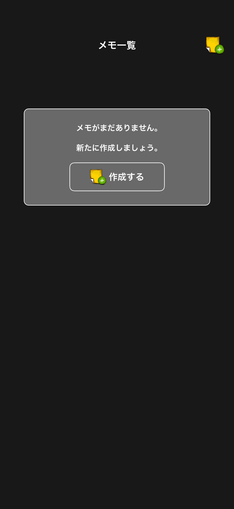
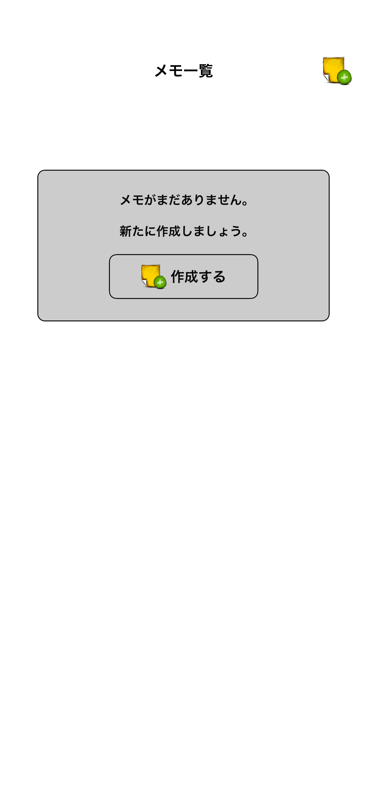
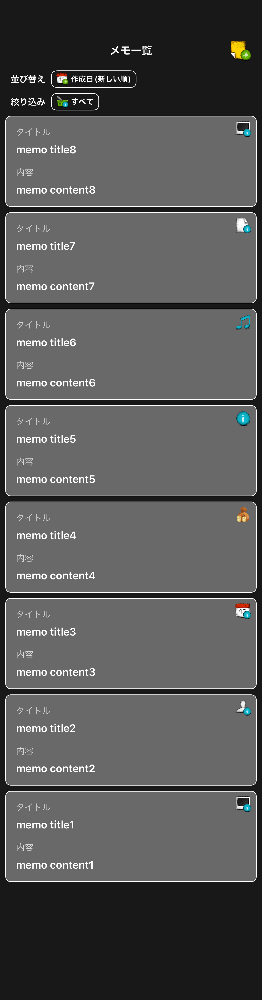
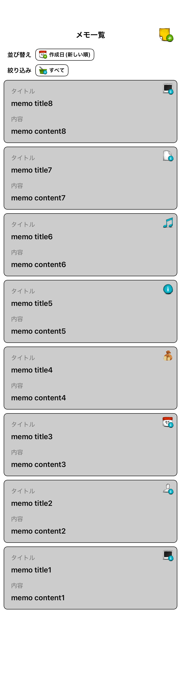
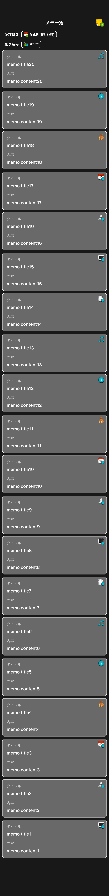
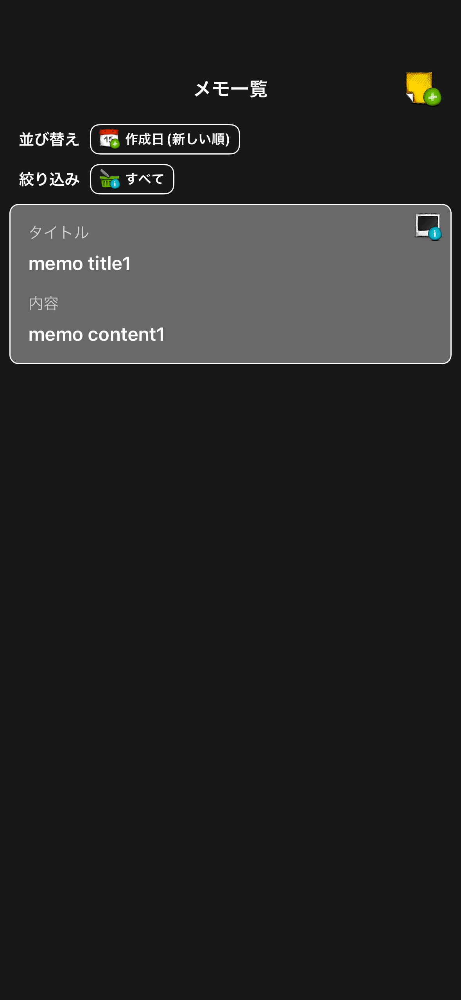
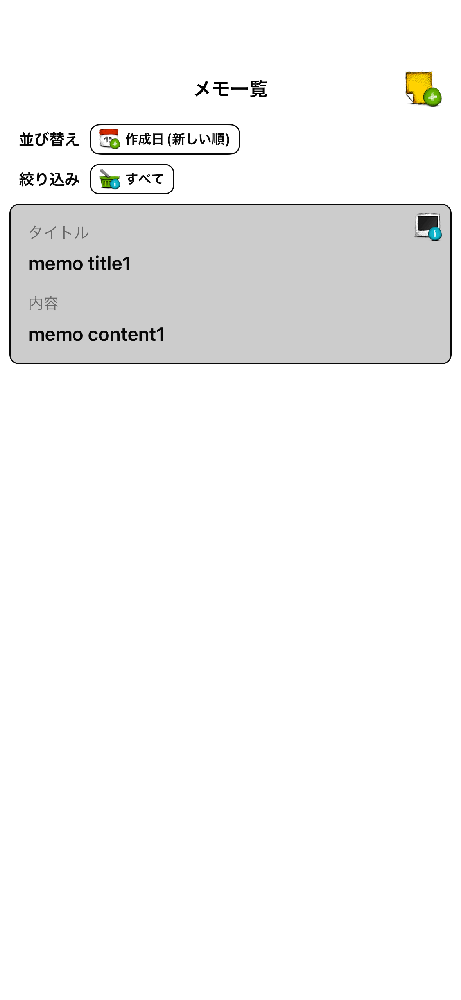

# MemoList

|件数0|件数0|
|:---:|:---:|
|Dark|Light|
|393x852.png|393x852.png|
|||

|件数中|件数中|
|:---:|:---:|
|Dark|Light|
|393x852.png|393x852.png|
|||

|件数多|件数多|
|:---:|:---:|
|Dark|Light|
|393x852.png|393x852.png|
|||

|件数少|件数少|
|:---:|:---:|
|Dark|Light|
|393x852.png|393x852.png|
|||

