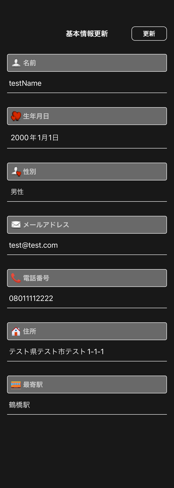
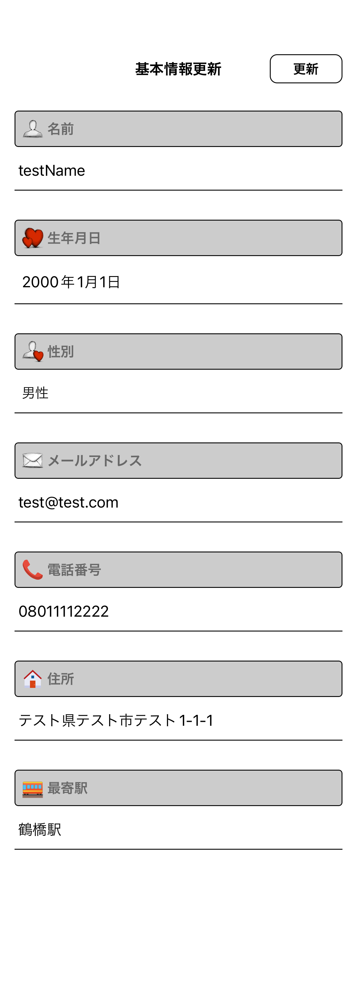
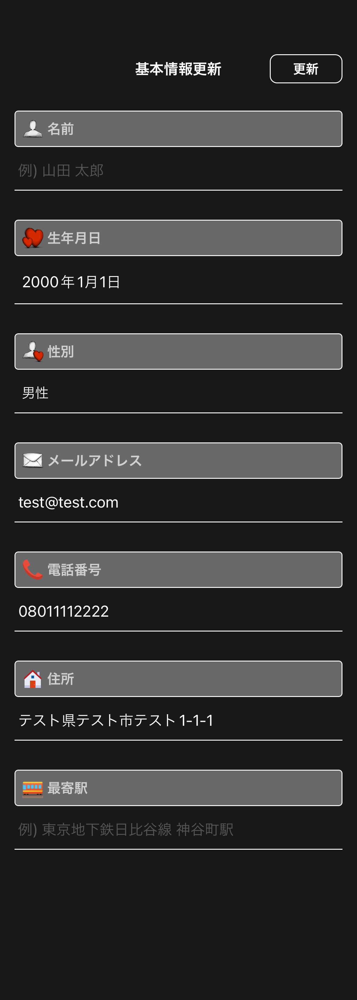
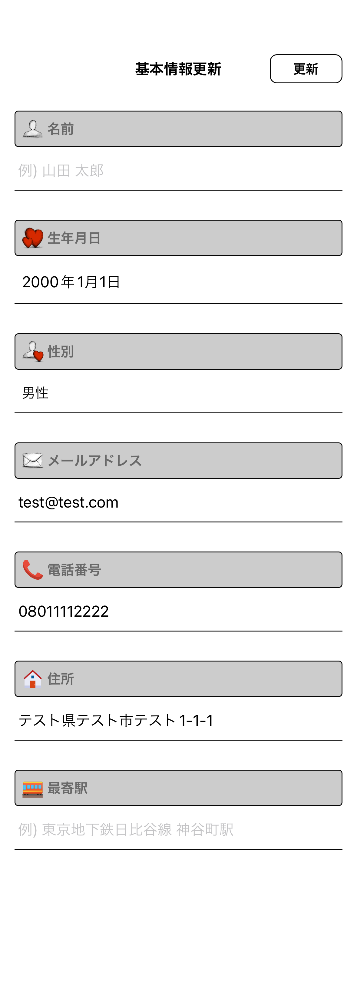
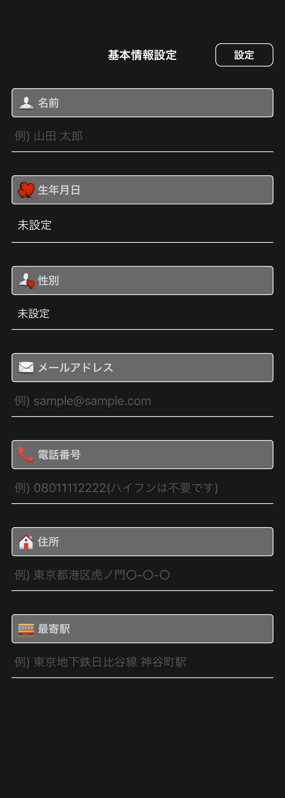
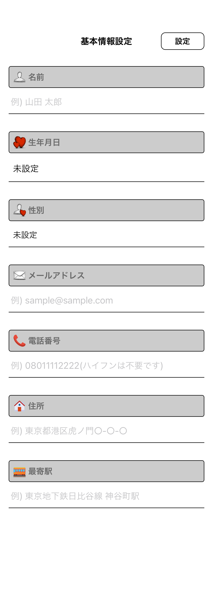

# profile_basic_update

|更新|更新|
|:---:|:---:|
|Dark|Light|
|393x852.png|393x852.png|
|||

|更新 未設定項目あり|更新 未設定項目あり|
|:---:|:---:|
|Dark|Light|
|393x852.png|393x852.png|
|||

|設定|設定|
|:---:|:---:|
|Dark|Light|
|393x852.png|393x852.png|
|||

