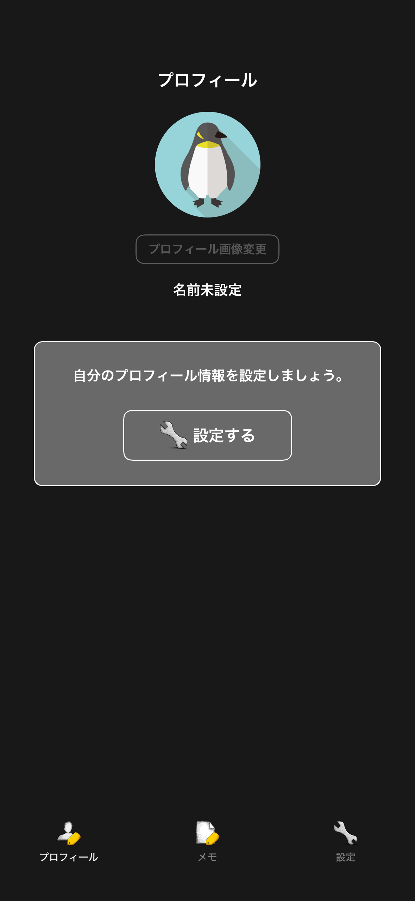
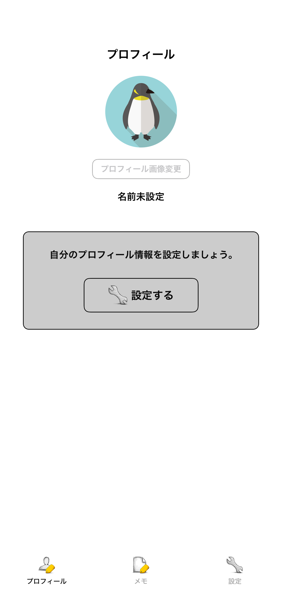
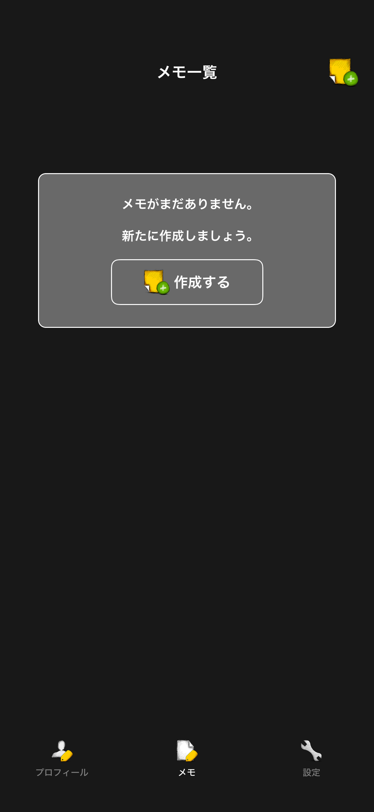
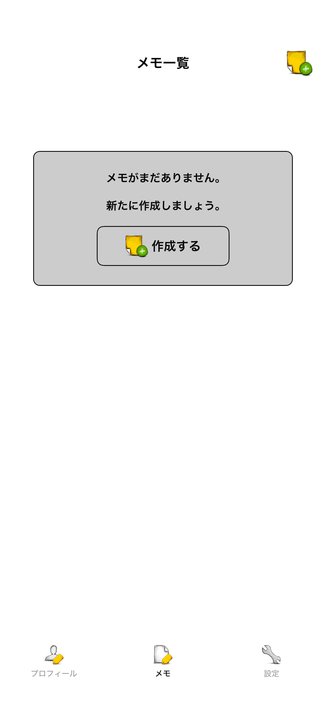
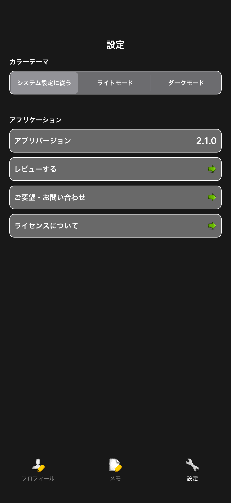
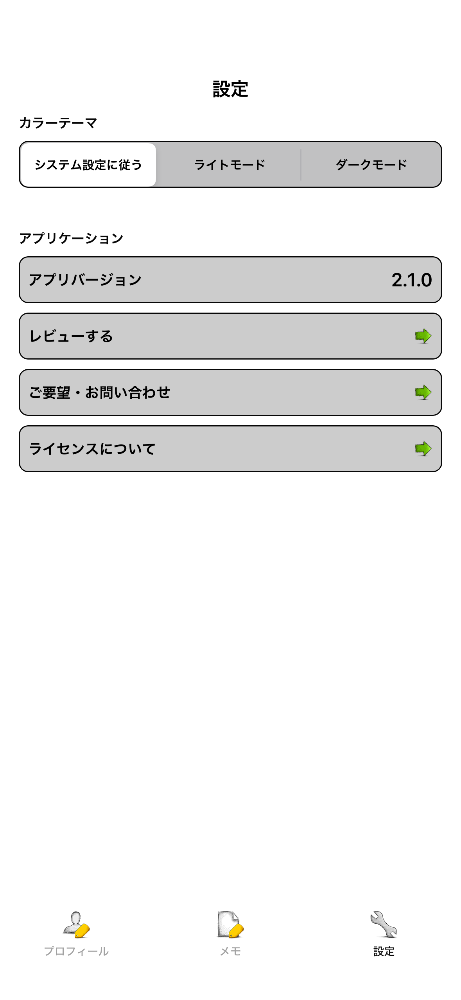

# tab

|プロフィールタブ|プロフィールタブ|
|:---:|:---:|
|Dark|Light|
|393x852.png|393x852.png|
|||

|メモタブ|メモタブ|
|:---:|:---:|
|Dark|Light|
|393x852.png|393x852.png|
|||

|設定タブ|設定タブ|
|:---:|:---:|
|Dark|Light|
|393x852.png|393x852.png|
|||

