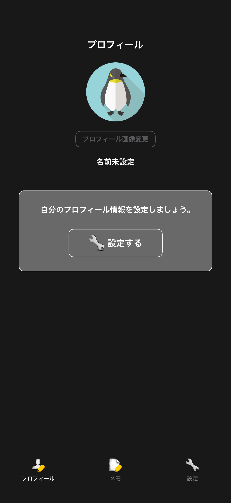
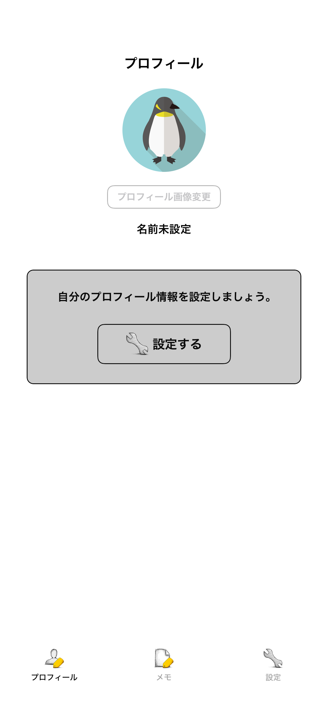
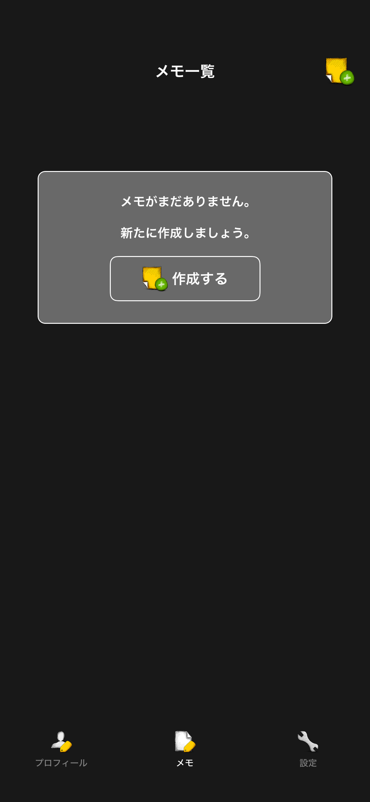
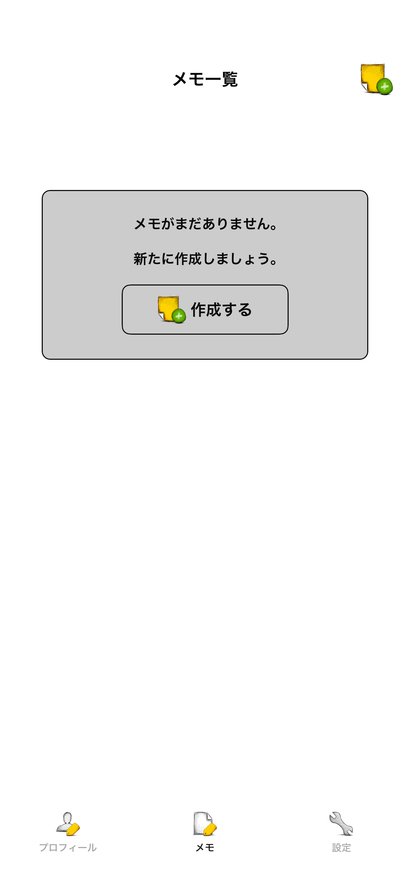
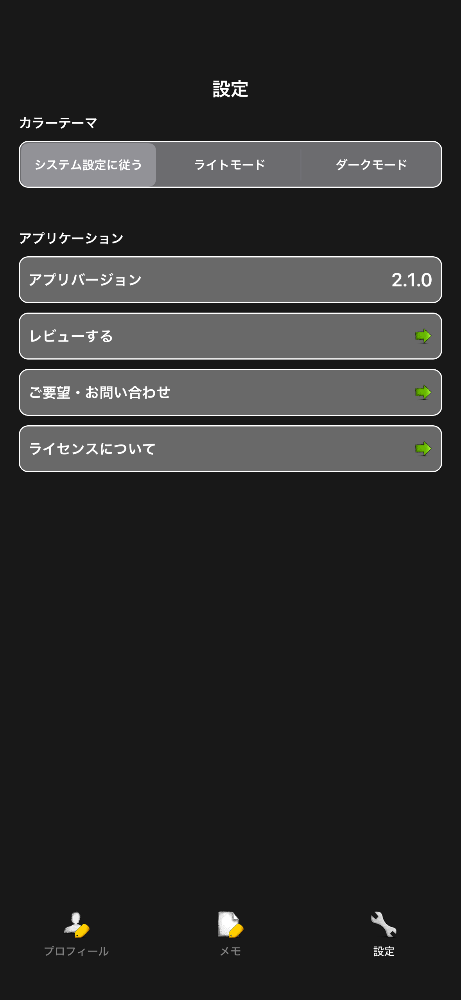
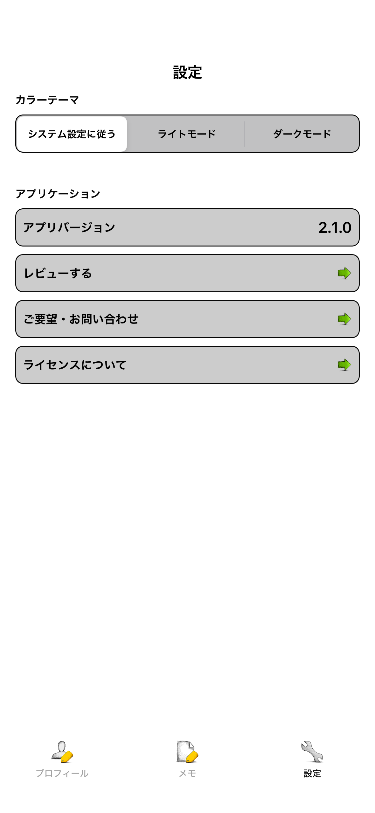

# タブ

|プロフィールタブ Dark|プロフィールタブ Light|
|:---:|:---:|
|17.2|17.2|
|iPhone|iPhone|
|||

|メモタブ Dark|メモタブ Light|
|:---:|:---:|
|17.2|17.2|
|iPhone|iPhone|
|||

|設定タブ Dark|設定タブ Light|
|:---:|:---:|
|17.2|17.2|
|iPhone|iPhone|
|||

