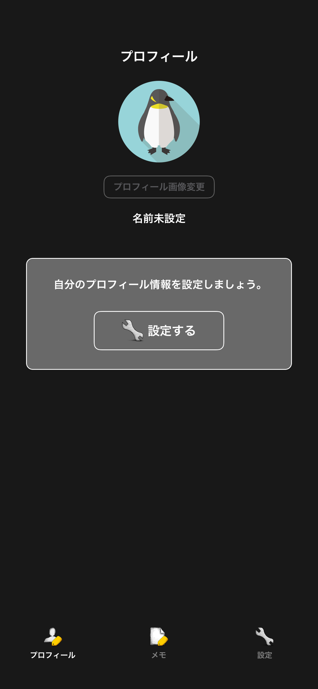
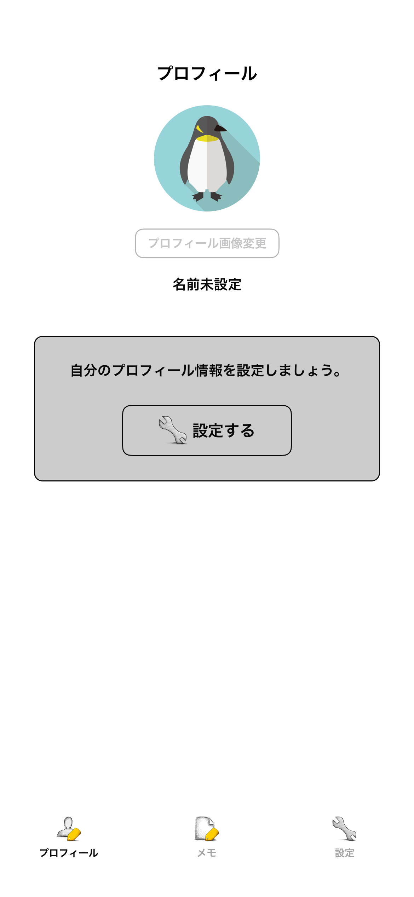
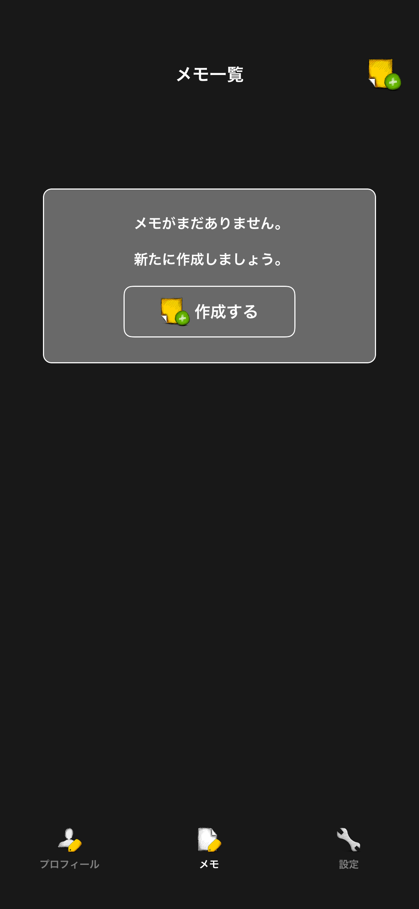
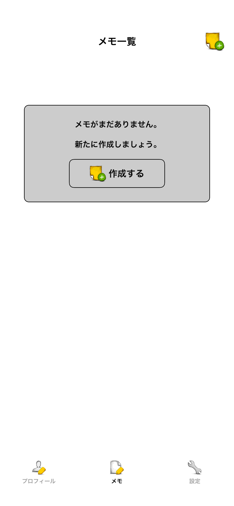
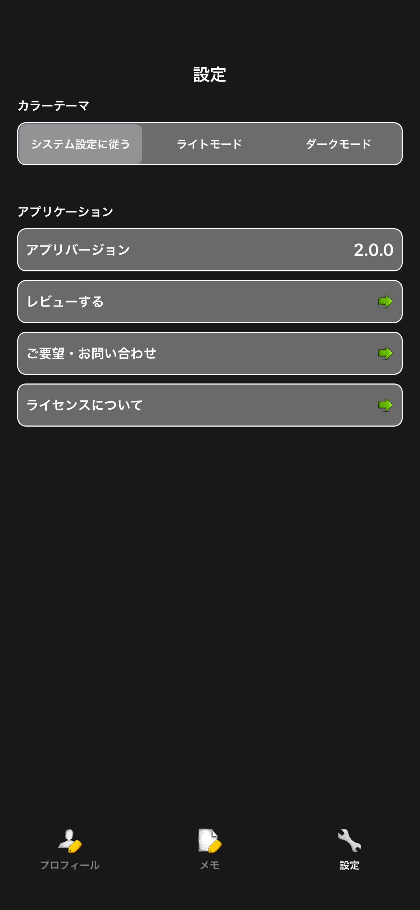
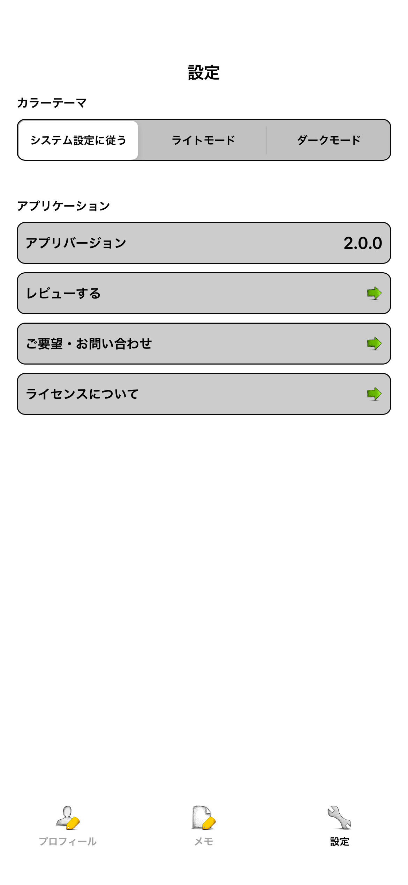

# タブ

|プロフィールタブ Dark|プロフィールタブ Light|
|:---:|:---:|
|16.4|16.4|
|iPhone14|iPhone14|
|||

|メモタブ Dark|メモタブ Light|
|:---:|:---:|
|16.4|16.4|
|iPhone14|iPhone14|
|||

|設定タブ Dark|設定タブ Light|
|:---:|:---:|
|16.4|16.4|
|iPhone14|iPhone14|
|||

