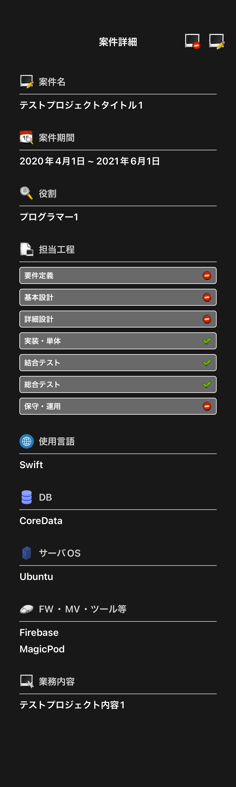
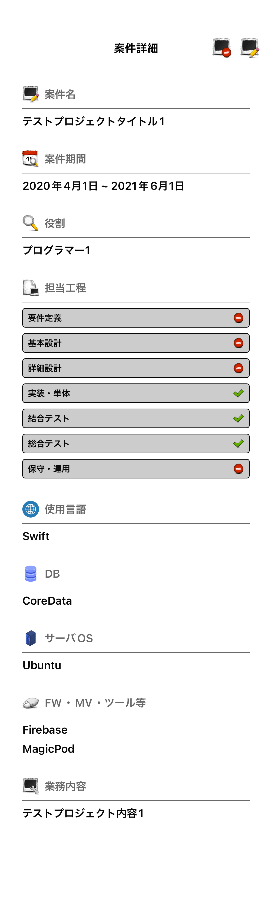

# プロフィール案件詳細画面

|詳細ダークモード|詳細ライトモード|
|:---:|:---:|
|16.4|16.4|
|iPhone14|iPhone14|
|||

|詳細終了期間未設定ダークモード|詳細終了期間未設定ライトモード|
|:---:|:---:|
|16.4|16.4|
|iPhone14|iPhone14|
|||

|詳細開始期間未設定ダークモード|詳細開始期間未設定ライトモード|
|:---:|:---:|
|16.4|16.4|
|iPhone14|iPhone14|
|||

