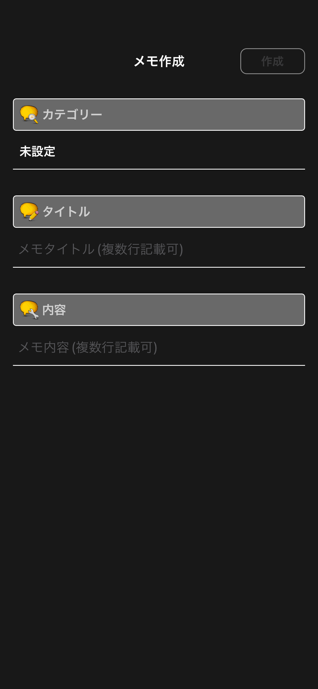
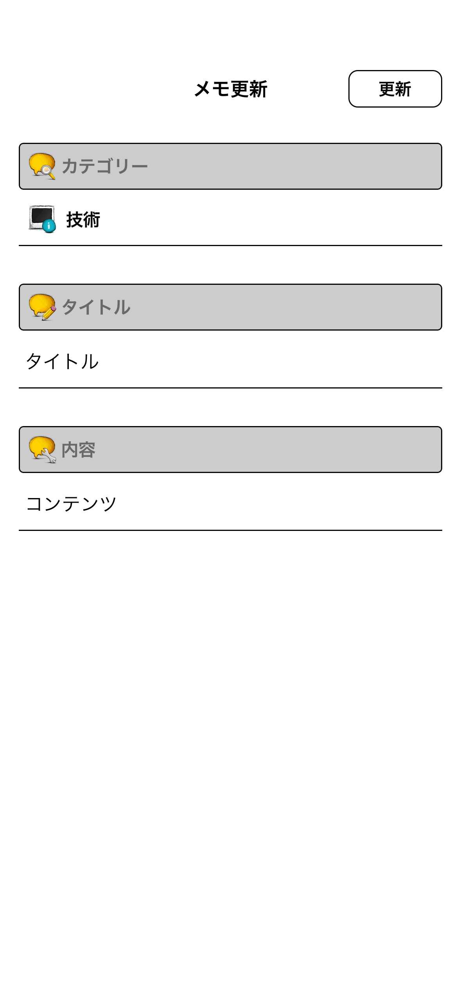
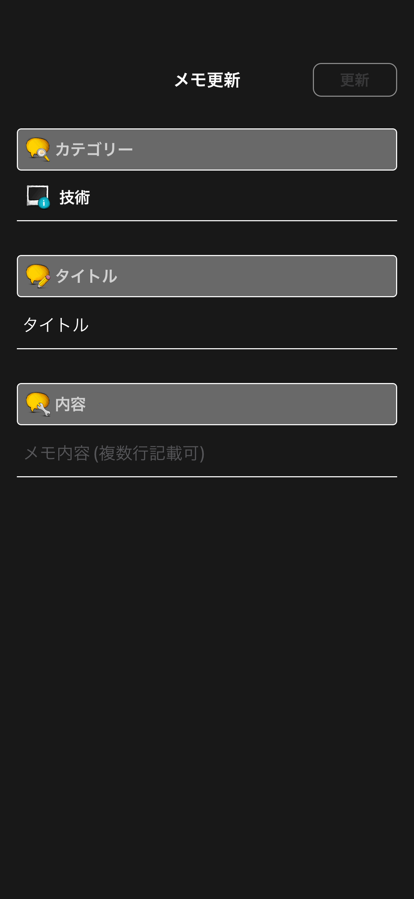
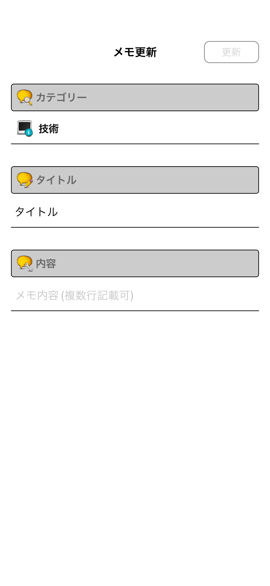

# メモ作成・編集画面

|作成 Dark|作成 Light|
|:---:|:---:|
|17.0|17.0|
|iPhone|iPhone|
|||

|編集 Dark|編集 Light|
|:---:|:---:|
|17.0|17.0|
|iPhone|iPhone|
|||

|編集 未入力項目あり Dark|編集 未入力項目あり Light|
|:---:|:---:|
|17.0|17.0|
|iPhone|iPhone|
|||

