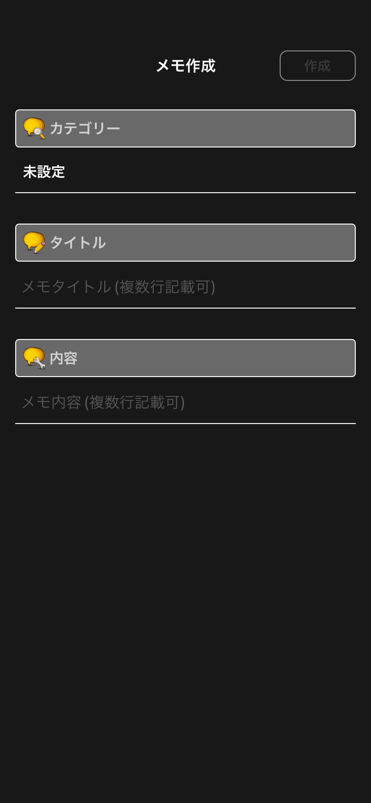
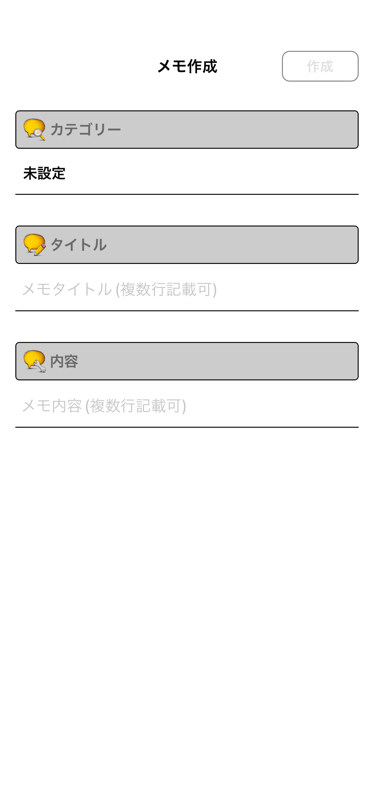
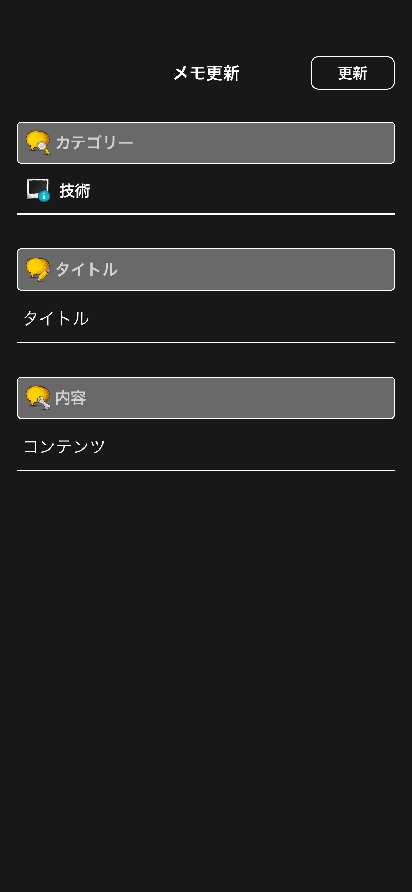
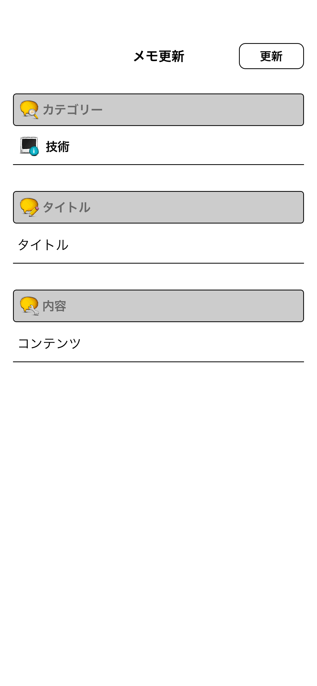
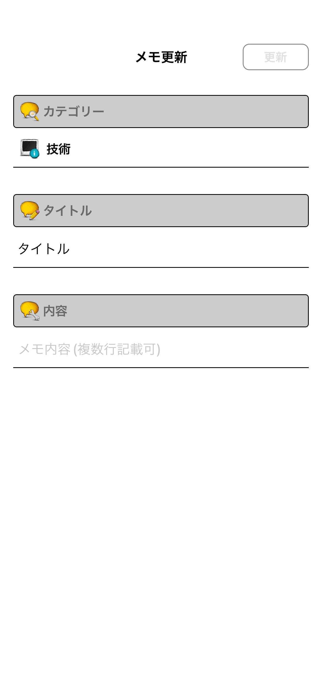

# メモ作成・編集画面

|作成 Dark|作成 Light|
|:---:|:---:|
|16.4|16.4|
|iPhone14|iPhone14|
|||

|編集 Dark|編集 Light|
|:---:|:---:|
|16.4|16.4|
|iPhone14|iPhone14|
|||

|編集 未入力項目あり Dark|編集 未入力項目あり Light|
|:---:|:---:|
|16.4|16.4|
|iPhone14|iPhone14|
|||

