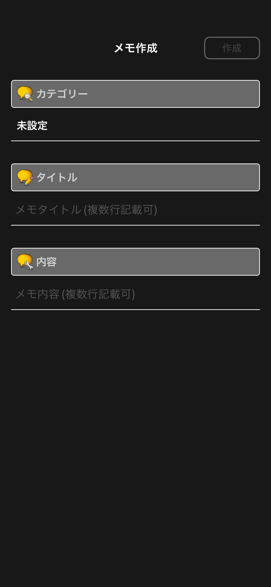
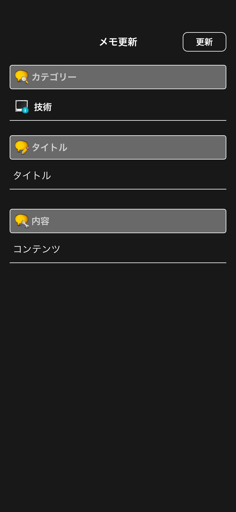
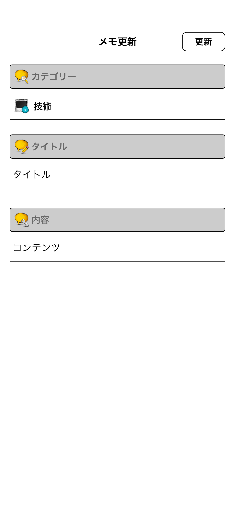
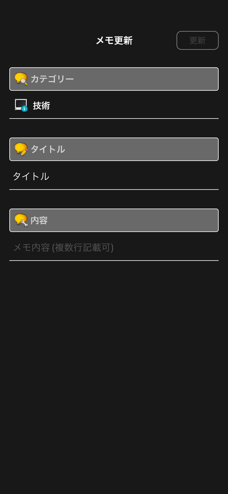
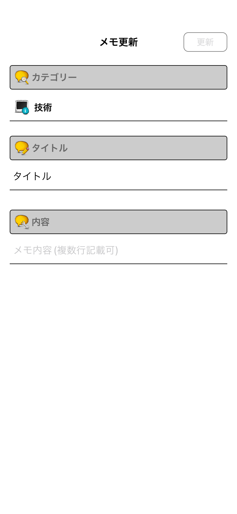

# メモ作成・編集画面

|作成ダークモード|作成ライトモード|
|:---:|:---:|
|16.4|16.4|
|iPhone14|iPhone14|
|||

|編集ダークモード|編集ライトモード|
|:---:|:---:|
|16.4|16.4|
|iPhone14|iPhone14|
|||

|編集未入力項目ありダークモード|編集未入力項目ありライトモード|
|:---:|:---:|
|16.4|16.4|
|iPhone14|iPhone14|
|||

