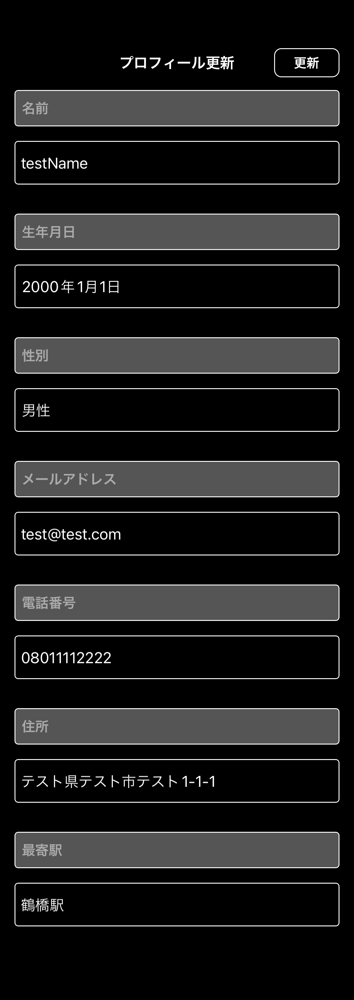
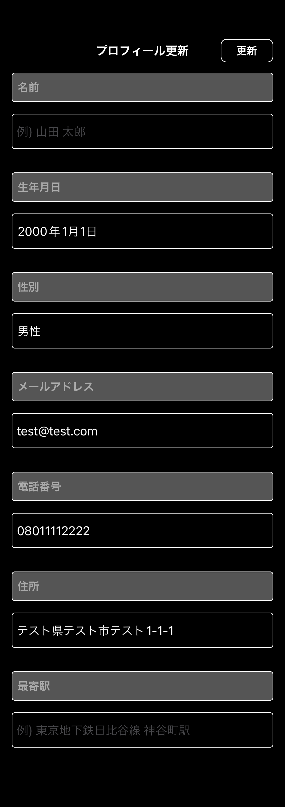

# プロフィール設定・更新画面

|編集ダークモード|編集ライトモード|
|:---:|:---:|
|16.0|16.0|
|iPhone14|iPhone14|
|||

|編集未設定項目ありダークモード|編集未設定項目ありライトモード|
|:---:|:---:|
|16.0|16.0|
|iPhone14|iPhone14|
|||

|設定ダークモード|設定ライトモード|
|:---:|:---:|
|16.0|16.0|
|iPhone14|iPhone14|
|||

