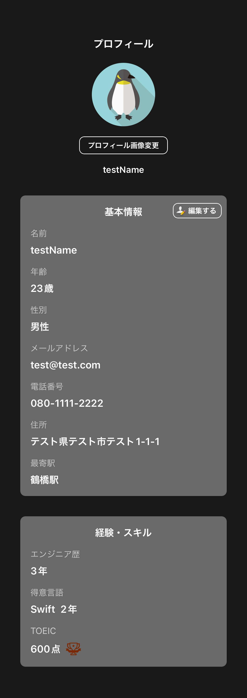
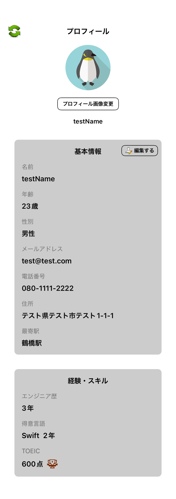
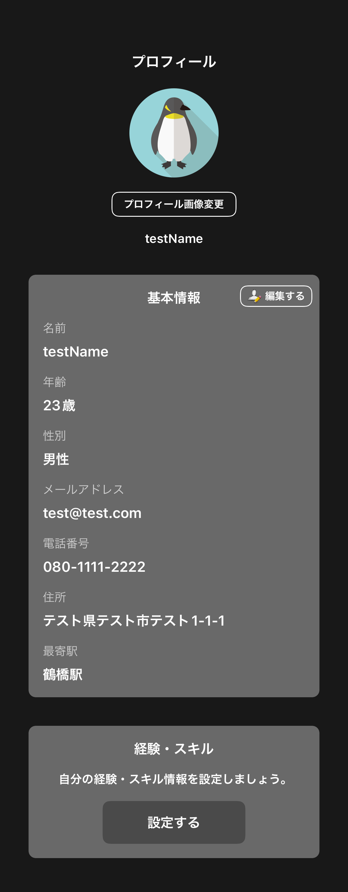
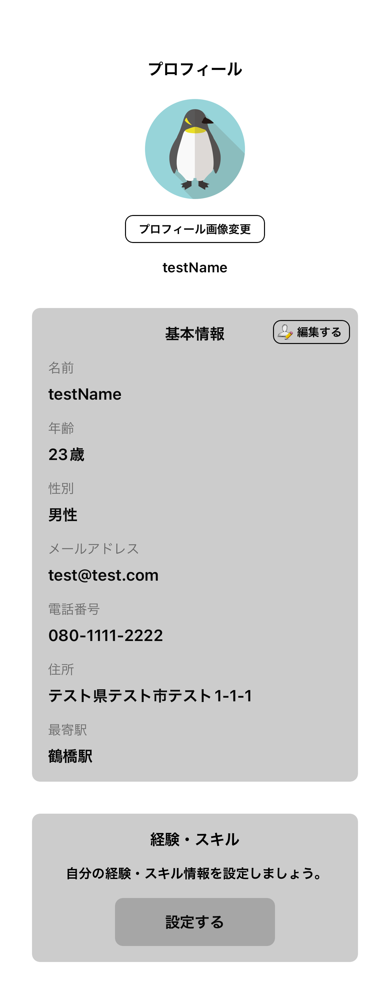
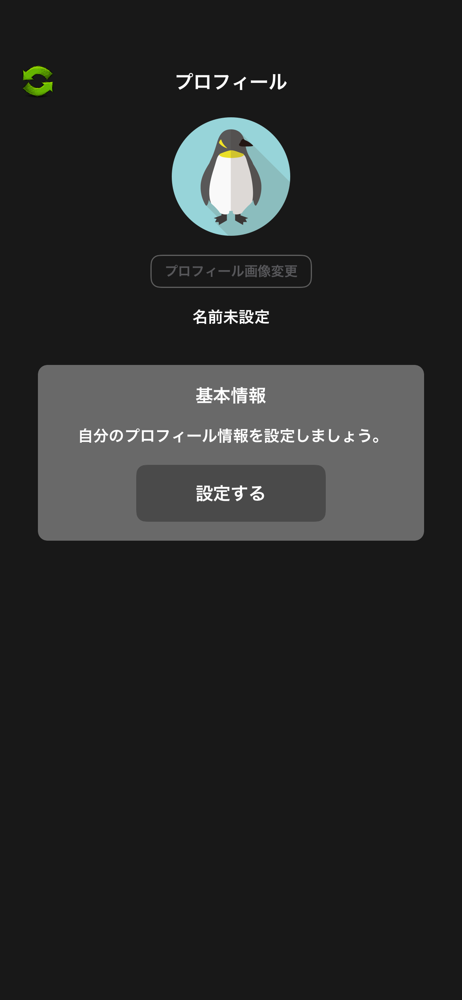
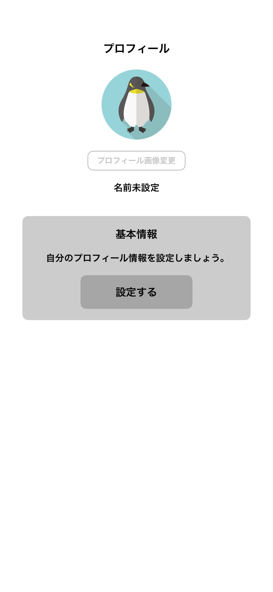

# プロフィール詳細画面

|基本情報経験スキル設定ダークモード|基本情報経験スキル設定ライトモード|
|:---:|:---:|
|16.0|16.0|
|iPhone14|iPhone14|
|||

|基本情報設定ダークモード|基本情報設定ライトモード|
|:---:|:---:|
|16.0|16.0|
|iPhone14|iPhone14|
|||

|未設定ダークモード|未設定ライトモード|
|:---:|:---:|
|16.0|16.0|
|iPhone14|iPhone14|
|||

