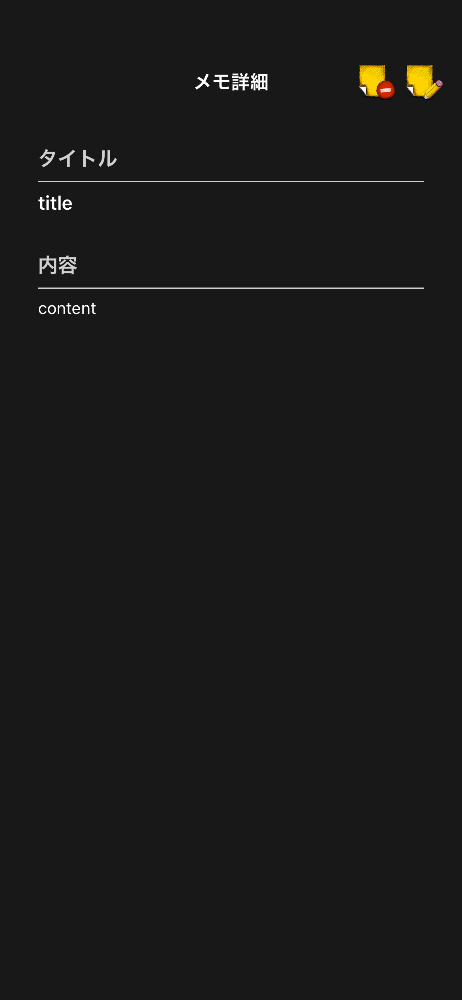
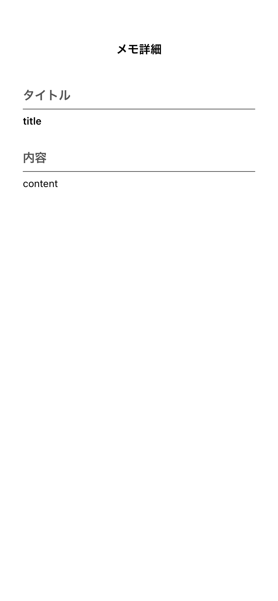
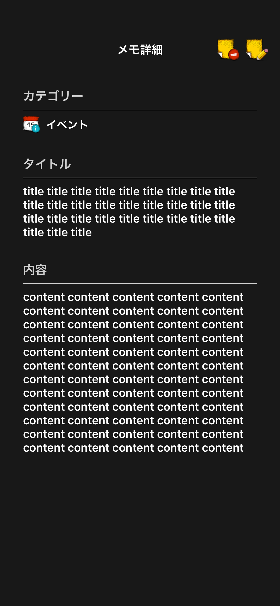
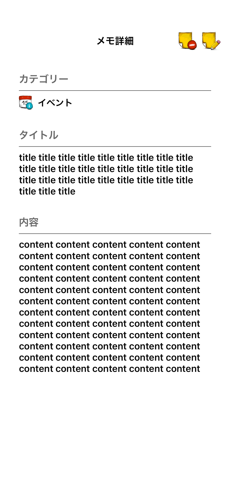

# メモ詳細画面

|標準ダークモード|標準ライトモード|
|:---:|:---:|
|16.0|16.0|
|iPhone14|iPhone14|
|||

|短文ダークモード|短文ライトモード|
|:---:|:---:|
|16.0|16.0|
|iPhone14|iPhone14|
|||

|長文ダークモード|長文ライトモード|
|:---:|:---:|
|16.0|16.0|
|iPhone14|iPhone14|
|||

