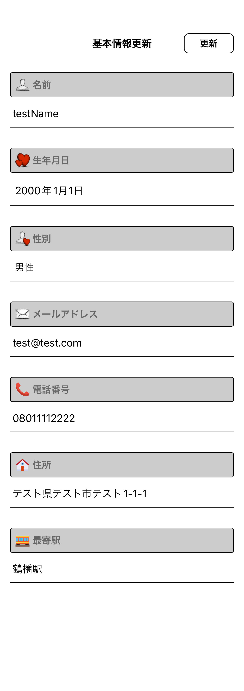
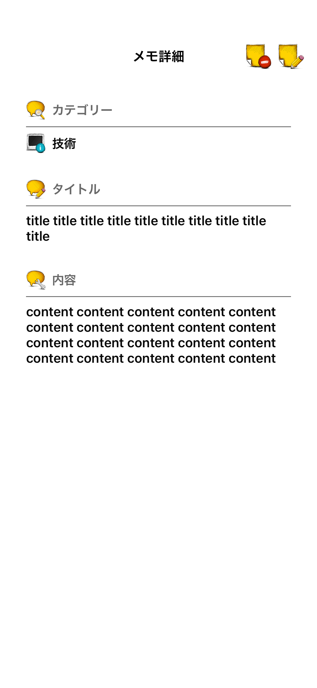

# EngineerMemo

## アプリ画面(Snapshot)

* [画面一覧](https://github.com/yossibank/EngineerMemo/tree/main/EngineerMemoSnapshotTests/Reports)

※ 画面例

* カスタムシート画面

|全項目存在長文ダークモード|全項目存在長文ライトモード|
|:---:|:---:|
|16.4|16.4|
|iPhone14|iPhone14|
|||

* プロフィールアイコン変更画面

|全項目ダークモード|全項目ライトモード|
|:---:|:---:|
|16.4|16.4|
|iPhone14|iPhone14|
|||

* プロフィール設定・更新画面

|更新ダークモード|更新ライトモード|
|:---:|:---:|
|16.4|16.4|
|iPhone14|iPhone14|
|||

* メモ一覧画面

|件数中ダークモード|件数中ライトモード|
|:---:|:---:|
|16.4|16.4|
|iPhone14|iPhone14|
|||

* メモ詳細画面

|標準ダークモード|標準ライトモード|
|:---:|:---:|
|16.4|16.4|
|iPhone14|iPhone14|
|||

## 対象OS

* iOS15以降

## 導入ライブラリ

* **Firebase**
* **SnapKit**
* **OHHTTPStubs**
* **iOSSnapshotTestCase**
* **Mockolo**
* **LicensePlist**
* **UIKitHelper(自作ライブラリ)**

## 導入ツール

* **SwiftFormat**
* **SwiftLint**
* **SwiftGen**
* **XcodeGen**

## プロジェクト設定

* `project.yml`内で管理、以下コマンド実行

```
make setup
```

## アーキテクチャ

**MVVM**

* **Model**(単体テスト対象)

* **ViewModel**(単体テスト対象)
  - **Router**(画面遷移管理)保持

* **View**(スナップショットテスト対象)
