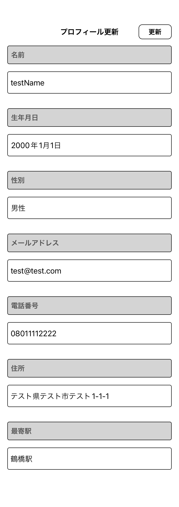

# EngineerMemo

## アーキテクチャ

**MVVM**

* **Model**(単体テスト対象)

* **ViewModel**(単体テスト対象)
  - **Router**(画面遷移管理)保持

* **View**

## 対象OS

* iOS14以降

## 導入ライブラリ

* **Firebase**
* **SnapKit**
* **OHHTTPStubs**
* **iOSSnapshotTestCase**
* **Mockolo**

## 導入ツール

* **SwiftFormat**
* **SwiftLint**
* **SwiftGen**
* **XcodeGen**

## プロジェクト設定

* `project.yml`内で管理、以下コマンド実行

```
make setup
```

## Snapshotテスト

* [プロフィール編集・更新画面](https://github.com/yossibank/EngineerMemo/blob/main/EngineerMemoTests/Reports/%E3%83%97%E3%83%AD%E3%83%95%E3%82%A3%E3%83%BC%E3%83%AB%E8%A8%AD%E5%AE%9A%E3%83%BB%E6%9B%B4%E6%96%B0%E7%94%BB%E9%9D%A2.md)

※ 参考(詳細画面)

|編集ダークモード|編集ライトモード|
|:---:|:---:|
|16.0|16.0|
|iPhone14|iPhone14|
|||