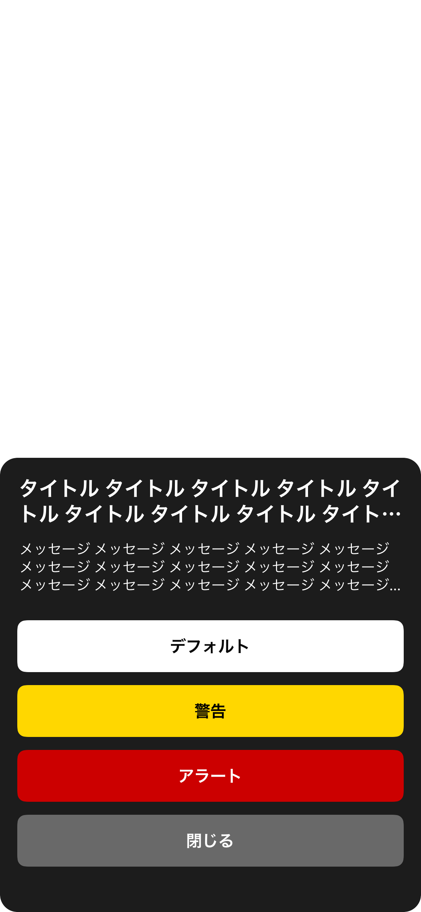
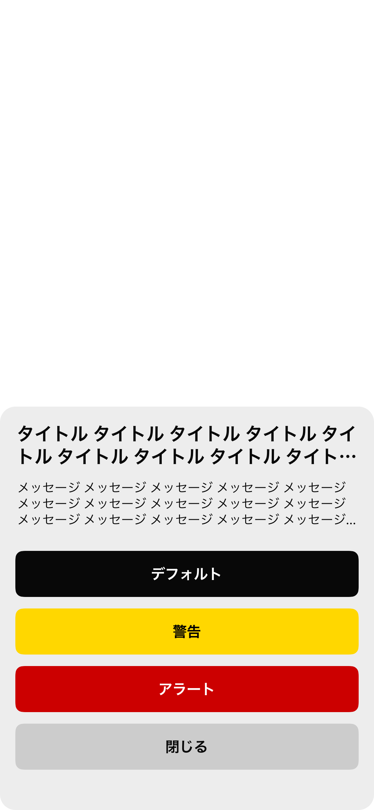
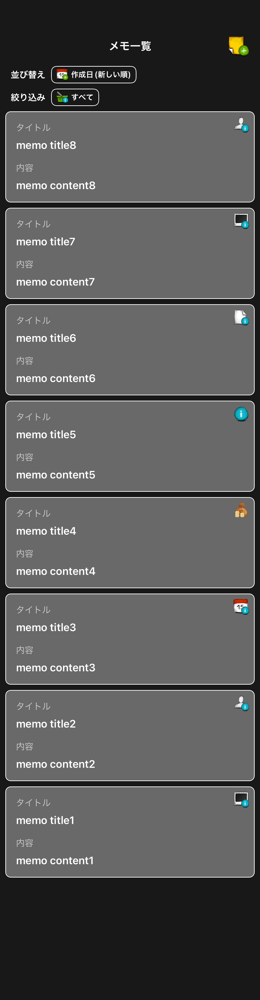

# EngineerMemo

## What's App

| | | | |
|:---:|:---:|:---:|:---:|
|  |  |  |  |

## App Store Link

https://apps.apple.com/us/app/%E3%82%A8%E3%83%B3%E3%83%A1%E3%83%A2/id6450376037

## App Screen(Snapshot)

* [ScreenList](https://github.com/yossibank/EngineerMemo/tree/main/EngineerMemoSnapshotTests/Reports)

※ Example

* カスタムシート画面

|全項目存在長文ダークモード|全項目存在長文ライトモード|
|:---:|:---:|
|16.4|16.4|
|iPhone14|iPhone14|
|||

* プロフィールアイコン変更画面

|全項目ダークモード|全項目ライトモード|
|:---:|:---:|
|16.4|16.4|
|iPhone14|iPhone14|
|||

* プロフィール設定・更新画面

|更新ダークモード|更新ライトモード|
|:---:|:---:|
|16.4|16.4|
|iPhone14|iPhone14|
|||

* メモ一覧画面

|件数中ダークモード|件数中ライトモード|
|:---:|:---:|
|16.4|16.4|
|iPhone14|iPhone14|
|||

* メモ詳細画面

|標準ダークモード|標準ライトモード|
|:---:|:---:|
|16.4|16.4|
|iPhone14|iPhone14|
|||

## Target OS

* above iOS15

## Library

* **Firebase**
* **SnapKit**
* **OHHTTPStubs**
* **iOSSnapshotTestCase**
* **Mockolo**
* **LicensePlist**
* **UIKitHelper(self-made Library)**

## Tool

* **SwiftFormat**
* **SwiftLint**
* **SwiftGen**
* **XcodeGen**

## Architecture

**MVVM with Combine**

* **Model**(Target UnitTest)
  - **Converter**

* **ViewModel**(Target UnitTest)
  - **Router**

* **View**(Target SnapshotTest)
