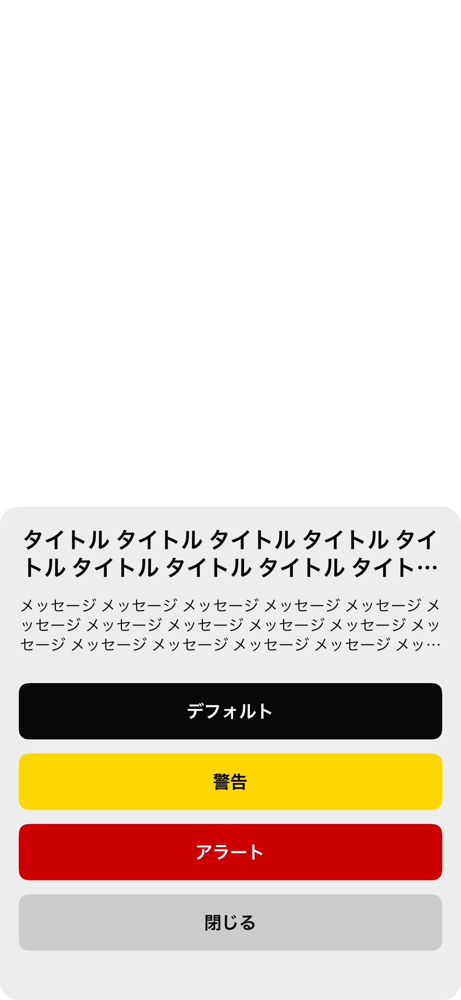

# エンメモ

       

## What's App

| | | | |
|:---:|:---:|:---:|:---:|
|  |  |  |  |

## App Store(2023/07/04~)

[![App Store Link][app-store-url]][AppStore]

[app-store-url]: https://img.shields.io/badge/App_Store-0D96F6?style=for-the-badge&logo=app-store&logoColor=white
[AppStore]: https://apps.apple.com/us/app/%E3%82%A8%E3%83%B3%E3%83%A1%E3%83%A2/id6450376037

## App Screen(Snapshot)

* [ScreenList](https://github.com/yossibank/EngineerMemo/tree/main/EngineerMemoSnapshotTests/Reports)

※ Example

* カスタムシート画面

|全項目存在 長文 Dark|全項目存在 長文 Light|
|:---:|:---:|
|17.2|17.2|
|iPhone14|iPhone14|
|||

* プロフィールアイコン変更画面

|全項目 Dark|全項目 Light|
|:---:|:---:|
|17.2|17.2|
|iPhone14|iPhone14|
|||

* プロフィール設定・更新画面

|更新 Dark|更新 Light|
|:---:|:---:|
|17.2|17.2|
|iPhone14|iPhone14|
|||

* メモ一覧画面

|件数中 Dark|件数中 Light|
|:---:|:---:|
|17.2|17.2|
|iPhone14|iPhone14|
|||

* メモ詳細画面

|標準 Dark|標準 Light|
|:---:|:---:|
|17.2|17.2|
|iPhone14|iPhone14|
|||

## Target OS

* **above iOS15**

## Library

* **Firebase**
* **SnapKit**
* **OHHTTPStubs**
* **iOSSnapshotTestCase**
* **Mockolo**
* **LicensePlist**
* **UIKitHelper(self-made Library)**

## Tool

* **SwiftFormat**
* **SwiftLint**
* **SwiftGen**
* **XcodeGen**

## Architecture

**MVVM + Router with Combine + UIKit**

* **Model**(Target UnitTest)
  - **Converter**

* **ViewModel**(Target UnitTest)
  - **Router**

* **View**(Target SnapshotTest)
